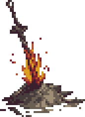
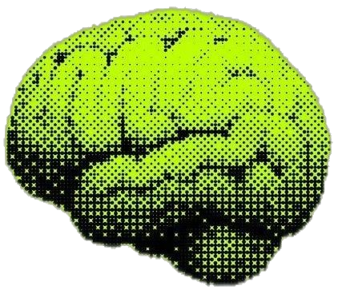

# Hi, I'm Ronald Sierra 

**Computer Science student @ Florida International University** 

**GPA 3.9 — Graduating May 2028.**

I'm a Computer Science student on an AI/ML track, working toward a master's degree in computer science. I'm building toward combining machine learning with a strong foundation in infrastructure to create large-scale ML systems for medical platforms, assisting in healthcare and pathology.

📫 ronald.sierra144@gmail.com &nbsp;|&nbsp; 💼 [LinkedIn](https://linkedin.com/in/ronaldsierra01)

---

#  Tech Stack:
           

## 🚀 Featured Projects

### 🧠 [Neural Network from Scratch](https://github.com/RonaldSierraDev/neural-network-from-scratch)
A fully-connected neural network built with **only Python and NumPy**
- Implemented forward propagation, backpropagation, and gradient descent by hand
- Multi-layer architecture with ReLU hidden layers and softmax output, trained on MNIST
- **In progress:** interactive TypeScript + FastAPI visualizer — draw a digit and watch the network classify it live, plus an end-to-end MLOps pipeline (Docker, CI/CD, AWS deployment)

### 🤖 [SearchPal](https://github.com/RonaldSierraDev/searchpal)
An AI job-application assistant powered by a **multi-agent CrewAI workflow**.
- Ingests a job posting + candidate experience, generates a tailored resume and interview prep materials
- Orchestrates 4 specialized agents (job research, candidate profiling, resume strategy, interview prep) over LLM APIs with Serper search, web scraping, and file-reading tools
- Currently leading a 5-developer team extending this into a full job-search platform

### 🐧 [Linuwu-Sense — Linux Kernel Module Contribution](https://github.com/RonaldSierraDev)
Open-source contribution to an acer-wmi kernel module fork.
- Added support for the Acer Predator PH315-52: Turbo mode + dual fan control on previously unsupported hardware
- Mapped the device through the driver's DMI matching and WMI capability system, validated on real hardware (kernel 6.14), and **submitted upstream**

---

## 🛠️ Technical Skills

| | |
|---|---|
| **Languages** | Python, TypeScript, Java, C, Bash |
| **ML / Data** | NumPy, neural networks from scratch, MNIST classification |
| **Frameworks & Tools** | FastAPI, CrewAI, REST APIs, Git/GitHub, Linux, LaTeX |
| **Currently learning** | MLOps (Docker, CI/CD), AWS, CNNs |

---

## 💼 What I bring beyond code

- **Team lead experience** — Led a 5-developer software development team; previously managed a 5-person research project delivering a client-facing fundraising strategy report
- **Operations under pressure** — as Shift Manager, raised customer satisfaction from 43% to 95% in under 6 months
- **Bilingual** — English / Spanish

---

🔎 **Open to Summer 2027 internships in ML/AI and software engineering** — feel free to reach out!
